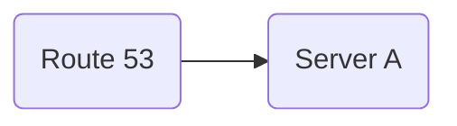
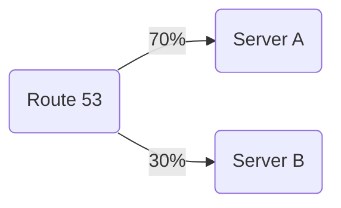
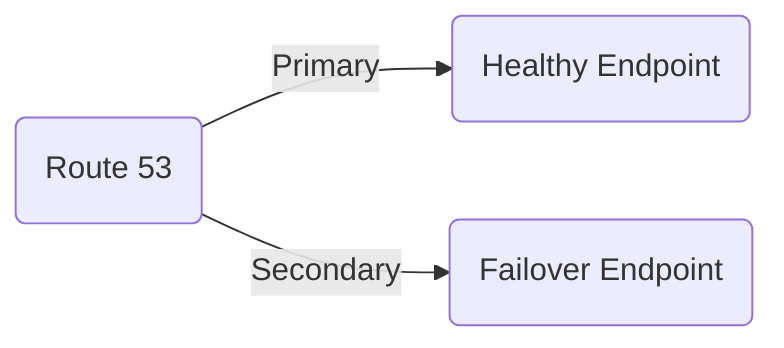

# ⭐ Attracting Summary for GitHub

This README is your **all‑in‑one premium guide** to fully understanding **AWS Route 53** — packed with clean explanations, diagrams, expert-level routing strategies, and real-world steps. It is designed to be **easy to read, powerful to learn from, and impressive to showcase on GitHub**, whether you’re a student, developer, or cloud engineer.

---

# 🛰️ AWS Route 53 – Complete Step‑by‑Step README

## 📘 Summary (Professional GitHub Project Version)

This README provides a **professional, structured, and comprehensive guide** to AWS Route 53. It covers everything from core DNS concepts and routing policies to real-world architectures and step-by-step implementation. Designed with clarity and depth, this documentation helps developers, learners, and cloud engineers quickly understand and apply Route 53 in production-ready environments. It is crafted to stand out on GitHub as a high‑quality, technically reliable, and visually engaging resource.

## 📘 Overview

This README gives you a **complete, easy-to-understand, and visually rich explanation of AWS Route 53** including concepts, routing policies, use cases, diagrams, and step-by-step creation guidance. It is designed to help beginners, students, and cloud engineers quickly master Route 53 while providing a professional-quality document suitable for GitHub.

## 📘 Overview

Amazon **Route 53** is a highly available and scalable **cloud DNS (Domain Name System)** web service by AWS. It provides domain registration, DNS routing, and health checking. It ensures your users reach your application reliably and with low latency.

---

## 🧠 Key Concepts of Route 53

### 1. **Hosted Zone**

A container that holds DNS records for your domain.

* **Public Hosted Zone** → For internet‑facing domains
* **Private Hosted Zone** → For VPC‑internal DNS

### 2. **DNS Records Types**

| Record    | Purpose                                               |
| --------- | ----------------------------------------------------- |
| **A**     | Maps domain → IPv4 address                            |
| **AAAA**  | Maps domain → IPv6 address                            |
| **CNAME** | Maps domain → another domain                          |
| **MX**    | Mail servers                                          |
| **TXT**   | Verification text                                     |
| **NS**    | Name servers                                          |
| **Alias** | AWS special routing to resources (LB, CloudFront, S3) |

### 3. **Routing Policies**

* **Simple Routing** – Direct mapping
* **Weighted Routing** – Distribute traffic by percentage
* **Latency-Based Routing** – Route to lowest-latency region
* **Failover Routing** – Active/Passive failover
* **Geolocation Routing** – Based on user country
* **Geoproximity** – Based on region bias

### 4. **Health Checks**

Route 53 can monitor endpoints and redirect traffic automatically if an endpoint becomes unhealthy.


## 🛠️ Step‑By‑Step: Create Hosted Zone & DNS Records

### ⚙️ Prerequisites

1. An AWS account with permissions for Route 53, EC2, and CloudFormation.
2. AWS CLI installed and configured (`aws configure`).
3. (Optional) A registered domain or willingness to register one via Route 53.

---

### 1) Create a Public Hosted Zone — Console

1. Open the **AWS Console** → **Route 53** → **Hosted zones**.
2. Click **Create hosted zone**.
3. Enter your domain name (e.g., `example.com`).
4. For Type choose **Public hosted zone**.
5. Click **Create hosted zone**. Route 53 will create **NS** and **SOA** records automatically.


### 2) Create Records — Console (A, CNAME, TXT, MX, Alias)

#### A (IPv4) / Alias to Load Balancer

1. In your hosted zone click **Create record**.
2. Select **Simple routing** or **Alias** if using an ELB/CloudFront.
3. For A record: Name: `@` (or leave blank), Value: `203.0.113.10` OR choose Alias → Load Balancer.
4. Click **Create records**.

#### CNAME (www to root)

1. Create record → Type: **CNAME** → Name: `www` → Value: `example.com` → Save.

#### TXT (domain verification)

1. Create record → Type: **TXT** → Name: `_acme-challenge` or `@` → Value: `"your-verification-string"` → Save.

#### MX (mail)

1. Create record → Type: **MX** → Name: `@` → Value: `10 mail.example.com.` → Save.

---


### 4) Create a Health Check & Configure Failover

1. Console → **Health checks** → **Create health check**.
2. Enter endpoint (IP/URL), protocol, and failure threshold.
3. Save and then create a **Failover** record set that references this health check (Primary/Secondary).

**Mermaid (Failover):**

```mermaid
graph LR
    A(Route 53) -->|Primary (health check)| B(Primary endpoint)
    A -->|Secondary| C(Secondary endpoint)
```

---


### 6) Verify DNS Propagation & Troubleshoot

* Check nameservers: `dig NS example.com +short`
* Verify A record: `dig A example.com +short`
* Check from public DNS tools (dnschecker.org) to see global propagation.

**Common issues & fixes:**

* **No response**: Ensure the hosted zone's NS records are added at the domain registrar.
* **Wrong IP**: Check for trailing dots and correct record type (A vs Alias).
* **SSL errors**: Ensure CloudFront/Load Balancer has the correct certificate and alias record.

---

### 7) Final Notes

* Prefer **Alias** records for AWS resources (ELB, CloudFront, S3) — they are free and support zone apex.
* Use **weighted** or **latency** routing for gradual deployments and global performance.
* Use **CloudWatch** + **Health Checks** for automated failover.

---

### ✅ **Step 1: Open Route 53 Console**

1. Go to **AWS Console**
2. Search for **Route 53**
3. Open the dashboard

---

### ✅ **Step 2: Create a Public Hosted Zone**

1. Click **Hosted Zones**
2. Select **Create Hosted Zone**
3. Enter your domain name (e.g., **example.com**)
4. Choose **Public Hosted Zone**
5. Click **Create**

This will generate NS and SOA records automatically.

---

### ✅ **Step 3: Add DNS Records**

#### **A Record – Point domain to EC2 / Load Balancer**

1. Go to your hosted zone
2. Click **Create Record**
3. Choose **A – IPv4 address**
4. Enter:

   * Name: `@`
   * Value: `IPv4 address` or **Alias → Load Balancer**
5. Save changes

#### **CNAME Record – Map subdomain to domain**

1. Choose **Create Record**
2. Type → **CNAME**
3. Name: `www`
4. Value: `example.com`

---

## 🎯 Routing Policies Example

### 🔹 Simple Routing



### 🔹 Weighted Routing



### 🔹 Failover Routing



---

## 🚨 Health Checks – Step by Step

1. Go to **Health Checks** in Route 53
2. Click **Create Health Check**
3. Enter endpoint URL/IP
4. Set evaluation periods
5. Configure **CloudWatch alarms** (optional)

This helps in failover routing.

---

## 🌍 Domain Registration via Route 53

1. Go to **Registered Domains**
2. Click **Register Domain**
3. Search and choose domain
4. Enter contact details
5. Purchase domain

Once registered, it is automatically added to Route 53.

---

## 🧩 Use Cases

* Hosting websites
* Load balancer DNS resolution
* Multi-region latency-based routing
* Failover disaster recovery
* Domain + SSL setup for CloudFront
* S3 static website hosting

---

## 🔗 Resource Links

* AWS Route 53 Docs
* DNS Best Practices
* Routing Policy Examples
* Multi-region architecture patterns

---

## 👤 Author Information

**Name:** Arkan Tandel
**GitHub:** [https://github.com/](https://github.com/)
**LinkedIn:** [https://linkedin.com/in/](https://linkedin.com/in/)
**Email:** (arkantandel)


