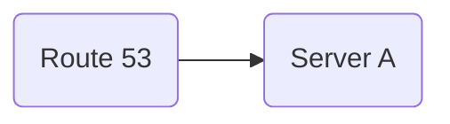
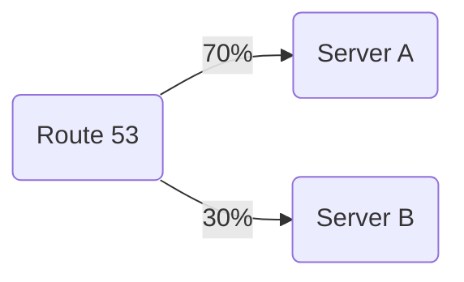
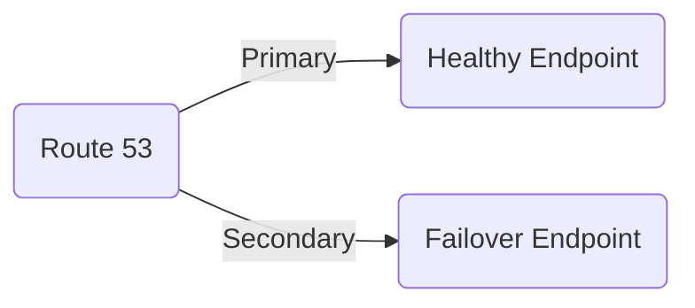

# AWS Route 53 - Complete Guide

## Overview

**Amazon Route 53** is a scalable and highly available **Domain Name System (DNS)** web service. It is designed to route end users to Internet applications by translating human-readable names like `www.example.com` into the numeric IP addresses like `192.0.2.1` that computers use to connect to each other. Route 53 also offers domain registration and health checking of resources.

---

## Key Features

1. **Domain Registration**
   - Register new domain names directly in AWS.
   - Transfer existing domains to Route 53.

2. **DNS Service**
   - Highly available and scalable DNS routing.
   - Supports various routing policies:
     - Simple Routing
     - Weighted Routing
     - Latency-based Routing
     - Failover Routing
     - Geolocation Routing
     - Multi-value Answer Routing

3. **Health Checks & Monitoring**
   - Automatically monitor the health of your resources.
   - Route traffic away from unhealthy endpoints.

4. **Traffic Management**
   - Distribute traffic across multiple servers or regions.
   - Optimize latency for end users.

5. **Integration with AWS Services**
   - Works seamlessly with AWS services like S3, CloudFront, Elastic Load Balancer, etc.

---

## Use Cases

- **Website Hosting**: Route users to your website hosted on AWS.
- **Failover & Disaster Recovery**: Automatic failover to healthy endpoints.
- **Global Traffic Management**: Optimize performance for global users.
- **Domain Management**: Centralized control of domain names.

---

## Step-by-Step Guide to Create Route 53 Hosted Zone and DNS Records

### 1. Create a Hosted Zone

1. Go to the **AWS Management Console**.
2. Navigate to **Route 53 → Hosted Zones**.
3. Click **Create Hosted Zone**.
4. Fill in:
   - **Domain Name**: `example.com`
   - **Type**: Public Hosted Zone
5. Click **Create Hosted Zone**.

> This creates a DNS container for your domain and provides **Name Servers (NS records)**.

---

### 2. Update Domain Name Servers

1. If you registered the domain outside AWS:
   - Go to your domain registrar.
   - Replace existing Name Servers with Route 53 NS records from the hosted zone.
2. This allows Route 53 to manage DNS for your domain.

---

### 3. Create DNS Records

Route 53 allows you to create different types of DNS records.

1. Go to your hosted zone.
2. Click **Create Record**.
3. Common Record Types:
   - **A Record**: Maps domain to an IPv4 address.
   - **AAAA Record**: Maps domain to an IPv6 address.
   - **CNAME Record**: Maps a subdomain to another domain name.
   - **MX Record**: Email exchange servers.
   - **TXT Record**: Text values for verification or SPF/DKIM.
4. Fill in the required details and click **Create Records**.

---

### 4. Implement Routing Policies (Optional)

Depending on your use case, choose a routing policy:

- **Simple Routing**: Route traffic to a single resource.
- **Weighted Routing**: Distribute traffic across multiple resources with specified weights.
- **Latency-based Routing**: Route traffic to the region with the lowest latency.
- **Failover Routing**: Route traffic to a standby resource if primary fails.
- **Geolocation Routing**: Route users based on geographic location.
- **Multi-value Routing**: Return multiple IP addresses for redundancy.

---

### 5. Health Checks (Optional)

1. Go to **Route 53 → Health Checks → Create Health Check**.
2. Enter the **endpoint IP or domain**.
3. Configure monitoring options.
4. Link health check to DNS record for automatic failover.

---

## Example DNS Setup

| Record Type | Name        | Value              | Routing Policy |
|------------|------------|------------------|----------------|
| A          | www        | 192.0.2.1         | Simple         |
| CNAME      | blog       | example.com       | Simple         |
| MX         | @          | 10 mail.example.com | Simple       |
| TXT        | @          | "v=spf1 include:example.com ~all" | Simple |

---

## Best Practices

1. Always use **health checks** for critical endpoints.
2. Use **alias records** when pointing to AWS resources like S3, ELB, or CloudFront.
3. Set **TTL values** according to the frequency of DNS changes.
4. Secure your domain using **AWS Certificate Manager (ACM)** and HTTPS.

---

## Resources

- [AWS Route 53 Documentation](https://docs.aws.amazon.com/route53/)
- [AWS Route 53 Pricing](https://aws.amazon.com/route53/pricing/)
- [AWS Route 53 Tutorials](https://aws.amazon.com/getting-started/hands-on/)

### ✅ **Step 1: Open Route 53 Console**

1. Go to **AWS Console**
2. Search for **Route 53**
3. Open the dashboard

---

### ✅ **Step 2: Create a Public Hosted Zone**

1. Click **Hosted Zones**
2. Select **Create Hosted Zone**
3. Enter your domain name (e.g., **example.com**)
4. Choose **Public Hosted Zone**
5. Click **Create**

This will generate NS and SOA records automatically.

---

### ✅ **Step 3: Add DNS Records**

#### **A Record – Point domain to EC2 / Load Balancer**

1. Go to your hosted zone
2. Click **Create Record**
3. Choose **A – IPv4 address**
4. Enter:

   * Name: `@`
   * Value: `IPv4 address` or **Alias → Load Balancer**
5. Save changes

#### **CNAME Record – Map subdomain to domain**

1. Choose **Create Record**
2. Type → **CNAME**
3. Name: `www`
4. Value: `example.com`

---

## 🎯 Routing Policies Example

### 🔹 Simple Routing

### 🔹 Weighted Routing

### 🔹 Failover Routing

---

## 🚨 Health Checks – Step by Step

1. Go to **Health Checks** in Route 53
2. Click **Create Health Check**
3. Enter endpoint URL/IP
4. Set evaluation periods
5. Configure **CloudWatch alarms** (optional)

This helps in failover routing.

---

## 🌍 Domain Registration via Route 53

1. Go to **Registered Domains**
2. Click **Register Domain**
3. Search and choose domain
4. Enter contact details
5. Purchase domain

Once registered, it is automatically added to Route 53.

---

## 🧩 Use Cases

* Hosting websites
* Load balancer DNS resolution
* Multi-region latency-based routing
* Failover disaster recovery
* Domain + SSL setup for CloudFront
* S3 static website hosting

---

## 🔗 Resource Links

* AWS Route 53 Docs
* DNS Best Practices
* Routing Policy Examples
* Multi-region architecture patterns

---

## 👤 Author Information

**Name:** Arkan Tandel

## Author

**Arkan Tandel**  
- [LinkedIn](https://www.linkedin.com/in/arkan-tandel)  
- [GitHub](https://github.com/arkan-tandel)

**Email:** (arkantadnel@gmail.com)

